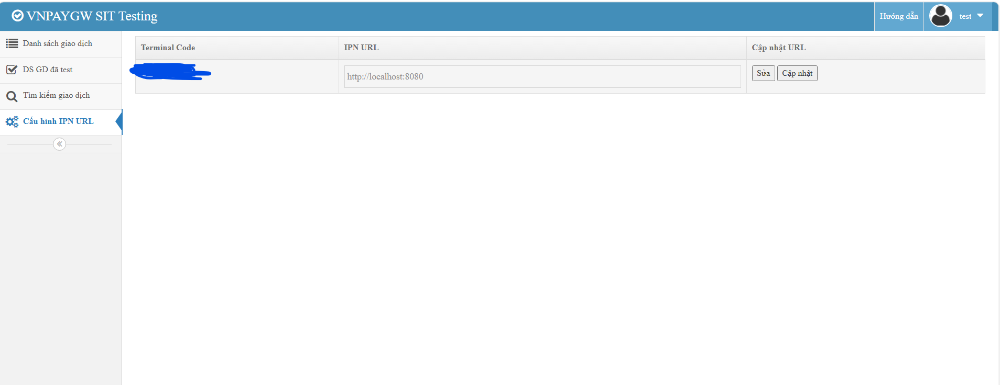

# Asp.net Core Web Api Backend Shopapp project

Hi there, I spent some time writing one backend RESTful api project for shop app online. This app was made for the sole purpose of study.

## Technologories:

- Asp.Net core Web Api (.Net 8).
- SQL Server.
- Redis
- Entity Framework core.
- Authentication and Authorization with jwt.
- Swagger.
- Docker.
- Payment method online: VNpay.

## Config "appsettings.json":

"TimeZoneId": use "Asia/Bangkok" with linux and "SE Asia Standard Time" with windows

##### Register merchant env test Vnpay at: https://sandbox.vnpayment.vn/devreg/

##### VNPay will send you the test configuration information via email.

#### Config IPN Url:

Access: https://sandbox.vnpayment.vn/vnpaygw-sit-testing. Config IPN URL set is "http://localhost:8080".

Deploy:

- cd ./backend_shopapp
- docker build -t name_image .
- docker run -d --name name_container -p 8080:8080 -v ./app/logs:/app/logs -v ./app/wwwroot:/app/wwwroot name_image

Docs api: "[your_domain]:8080/swagger".
Payment card(test): https://sandbox.vnpayment.vn/apis/vnpay-demo/
